# 📌 Main Thema  
**SK Magic Mall의 질의응답시스템에 단점에 대응한 새로운 Chat Bot Service 개발**

---
---


# 👨‍👩‍👧‍👦 Team Introduction

<table align="center">
  <tr>
    <td align="center" width="130">
      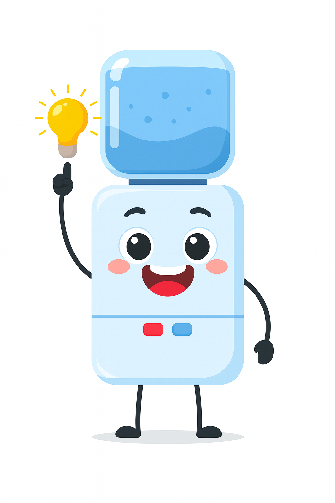<br>
      <b>이상효</b><br>
      팀장 (PM)<br>
      <a href="https://github.com/lsh7159">
        
      </a>
    </td>
    <td align="center" width="130">
      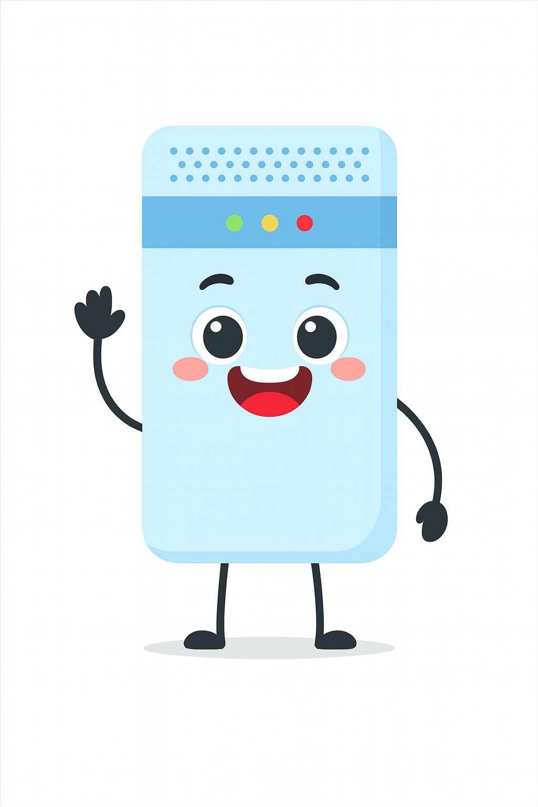<br>
      <b>김준규</b><br>
      1. 제품사용설명서 데이터 수집 <br> 2. RAG & LangChain Sub_Development <br> 3. Front Design <br>
      <a href="https://github.com/JungyuOO">
        
      </a>
    </td>
    <td align="center" width="130">
      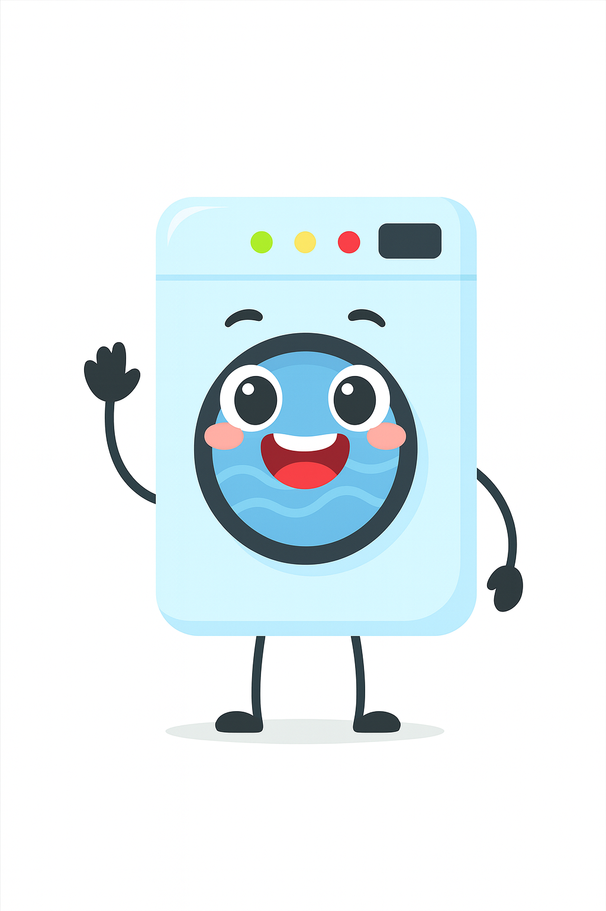<br>
      <b>김담하</b><br>
      1. Data_Crawling <br> 2. RAG & LangChain Sub_Development <br>
      <a href="https://github.com/DamHA-Kim">
        
      </a>
    </td>
    <td align="center" width="130">
      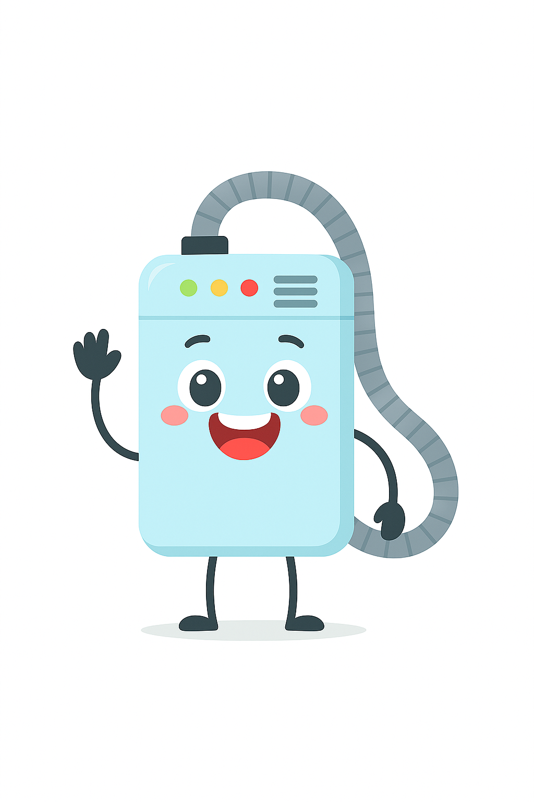<br>
      <b>손주영</b><br>
      1. RAG & LangChain Maintenance <br>
      <a href="https://github.com/sonjuyeong-00">
        
      </a>
    </td>
    <td align="center" width="130">
      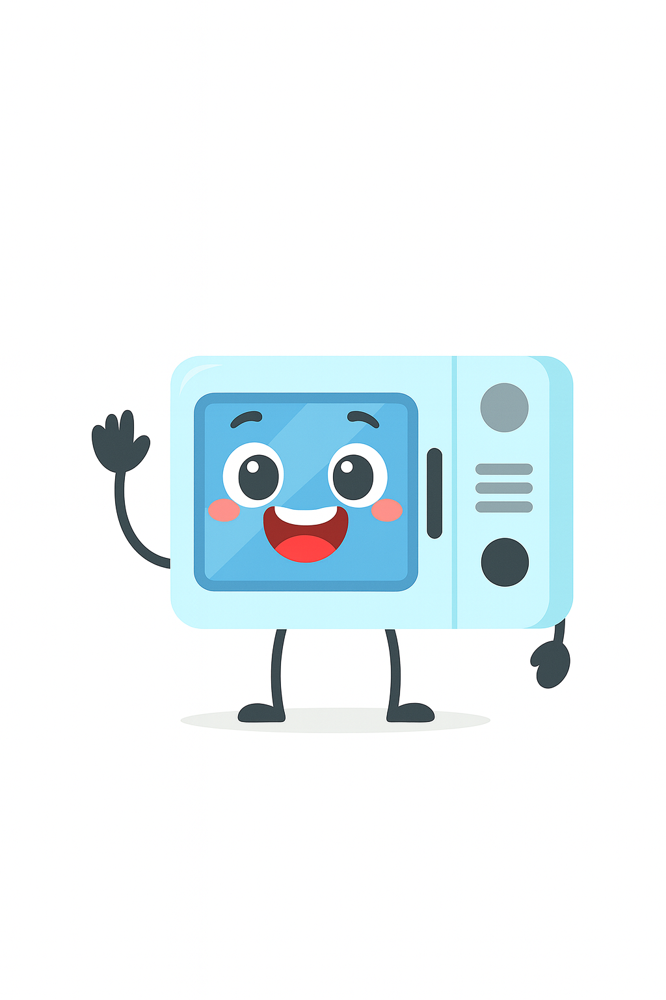<br>
      <b>임연희</b><br>
      1. FAQ 데이터 수집 <br> 2. Augmenting the ChatBot with a Memory System <br> 3. RAG & LangChain Sub_Development <br>
      <a href="https://github.com/yheeeon">
        
      </a>
    </td>
  </tr>
</table>

---
---

## 🛠️ Stacks

### Environment & Ops


### Backend · AI


### Data & Storage


### Communication


---
---


# 1️⃣ 프로젝트 개요  

## 🎯 Motivation

### 🔹 [1. AI산업 지원확대](https://www.seoulwire.com/news/articleView.html?idxno=494723)
<table align="center">
  <tr>
    <td align="center" width="300">
        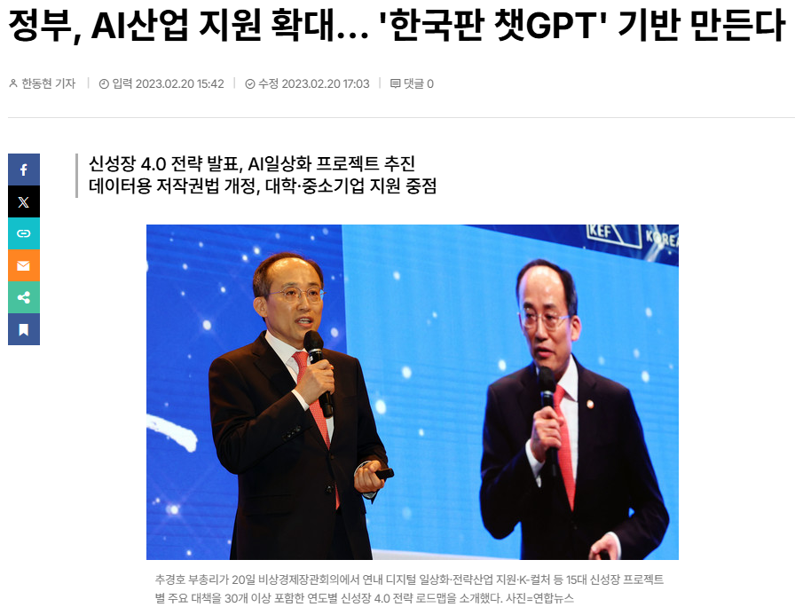<br>
  </tr>
</table>

- 정부가 초거대인공지능(AI)에 대한 지원을 확대하는 내용의"신성장 4.0 전략"을 발표

---

### 🔹 [2. 2025_OpenAI_GPT](https://www.lecturernews.com/news/articleView.html?idxno=189406)
<table align="center">
  <tr>
    <td align="center" width="300">
        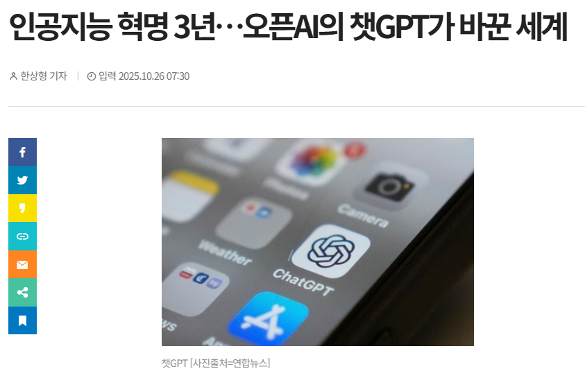<br>
  </tr>
</table>

- 2022.11: AI와 자연스러운 대화 시작작
- 2025.10: 국내 Chat_GPT 이용자 2천만명 이상

---

### 🔹 [3. 기업만 편한 챗봇](https://www.thescoop.co.kr/news/articleView.html?idxno=307075)

<table align="center">
  <tr>
    <td align="center" width="300">
        <br>
  </tr>
</table>

<table align="center">
  <tr>
    <td align="center" width="300">
        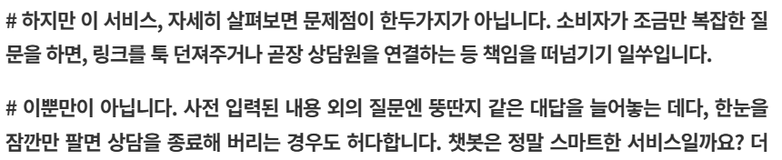<br>
  </tr>
</table>

---
---

## 🎯 문제정의

### 🔹 1. SK Magic Mall ChatBot Service
---
(1) 링크만 툭...
<table align="center">
  <tr>
    <td align="center" width="300">
        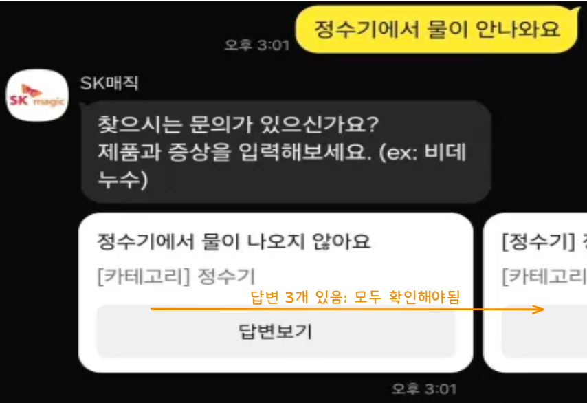<br>
  </tr>
</table>

---

(2) 제대로 대답은 하나..?

<table align="center">
  <tr>
    <td align="center" width="300">
        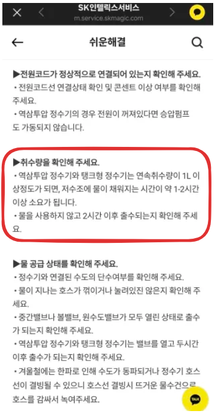<br>
  </tr>
</table>
- 취수량을 확인하라고..?
---


<table align="center">
  <tr>
    <td align="center" width="300">
        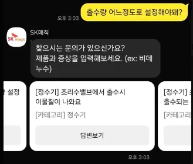<br>
  </tr>
</table>
- 질문 3개 다 확인해보자!

---
<table align="center">
  <tr>
    <td align="center" width="300">
        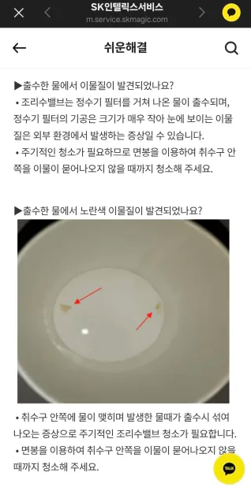<br>
  </tr>
</table>
- 이상한 대답도 나옴

---
---

## 🎯 문제해결방안
1. 기존의 SK Magic Mall ChatBot Service는 답변을 받으면 그와 관련된 링크만 툭 던짐

2. 그 링크마저 질문과 관련이 없는 대답이 나올 수 있음

3. SKN_3차_단위프로젝트_4팀은:
    - 위의 문제를 해결하기 위해 RAG기술을 도입하여 질문과 가장 밀접하게 연관된 문서를 검색하고

    - 그 내용을 기반으로 한 정확하고 문맥 이해력 있는 응답을 생성하도록 개선하였습니다.

---
---

# 2️⃣ System Info

## ERD
<table align="center">
  <tr>
    <td align="center" width="300">
        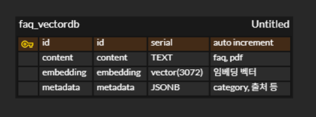<br>
  </tr>
</table>

## 화면설계
<table align="center">
  <tr>
    <td align="center" width="500">
        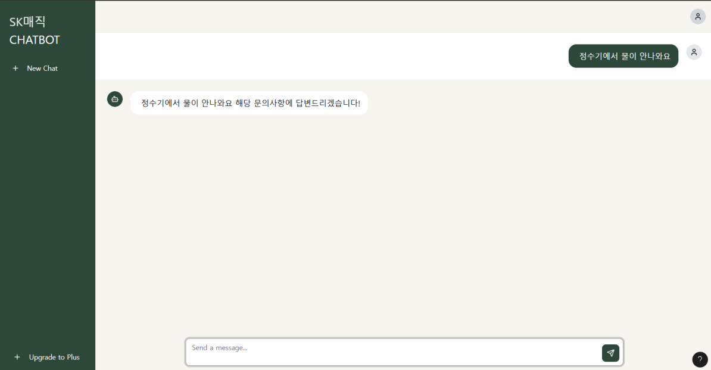<br>
  </tr>
</table>

## 🖥️ System Architecture
<table align="center">
  <tr>
    <td align="center" width="800">
        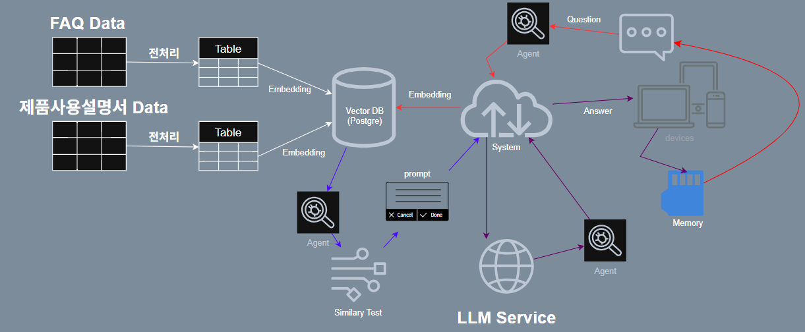<br>
  </tr>
</table>

---

## 📊 LangGraph
<table align="center">
  <tr>
    <td align="center" width="300">
        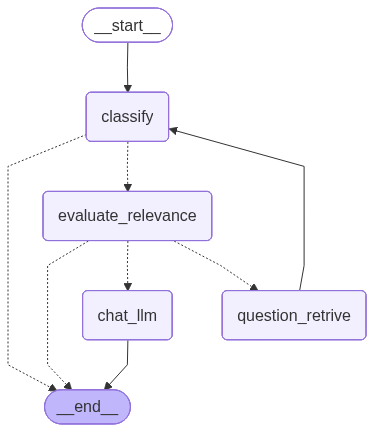<br>
  </tr>
</table>

---
---

# 3️⃣ System Implementation

<table align="center">
  <tr>
    <td align="center" width="500">
        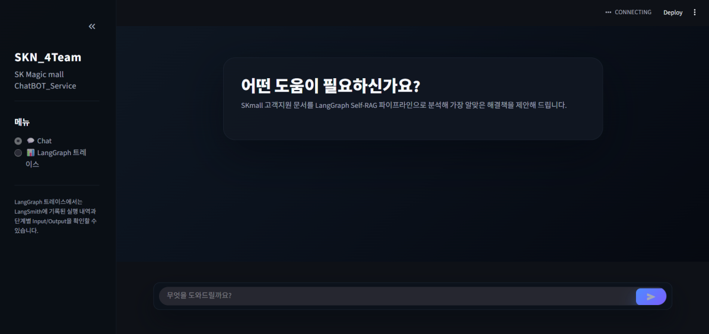<br>
  </tr>
</table>

<table align="center">
  <tr>
    <td align="center" width="500">
        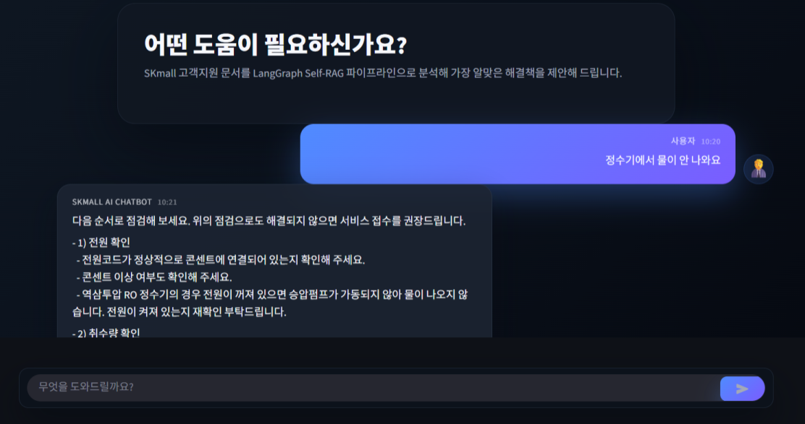<br>
  </tr>
</table>

<table align="center">
  <tr>
    <td align="center" width="500">
        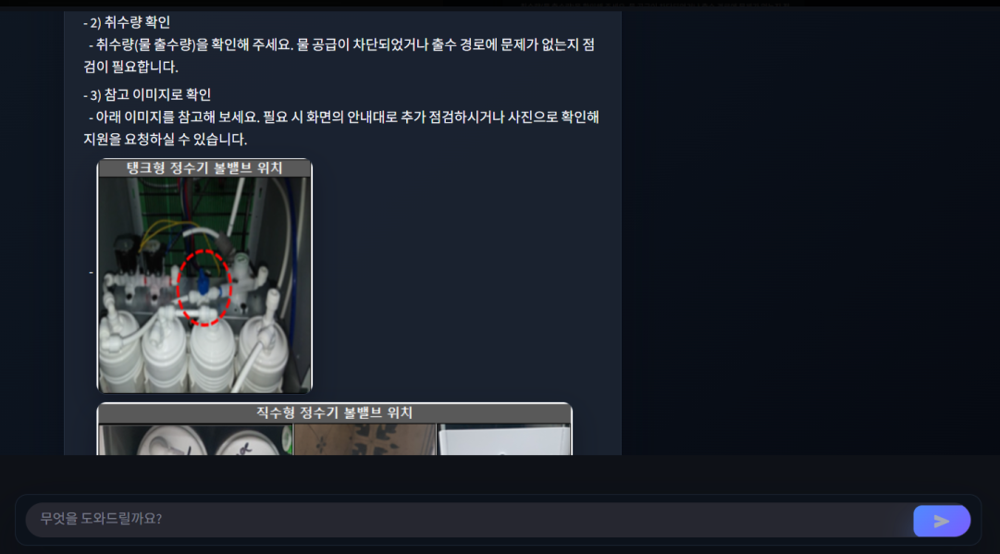<br>
  </tr>
</table>

<table align="center">
  <tr>
    <td align="center" width="500">
        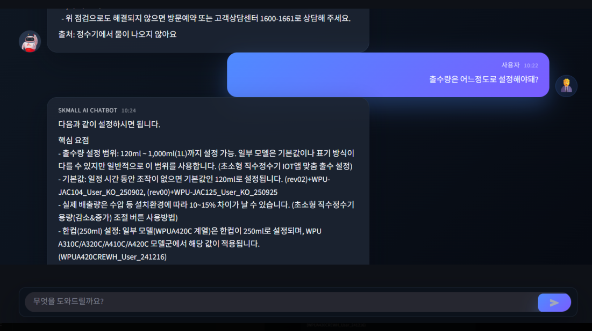<br>
  </tr>
</table>

<table align="center">
  <tr>
    <td align="center" width="500">
        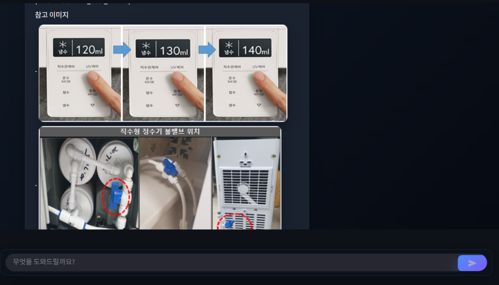<br>
  </tr>
</table>

---
---

# 4️⃣ 기대효과

- 1. 기존의 챗봇서비스는 링크만 툭 던져주는 시스템이였으나 4팀이 개발한 서비스에서는 바로 정보가 제공되기 때문에 유저들의 가시성 측면에서 선호도가 높을 거라 생각된다.

- 2. 기존의 챗봇서비스는 하나의 질문만 처리할 수 있지만 4팀이 개발한 챗봇 서비스는 2개 이상의 질문을 한번에 처리할 수 있다.

- 3. 기존의 챗봇서비스는 유저들의 질문에 링크를 3~4개 제공하고 질문에 대한 정확도가 떨어지는 반면 4팀이 개발한 서비스에서는 질문에 대한 정확한 답변이 가능하기에 (RAG사용) 유저들의 서비스 제공 측면에서 이점이 있을것이라 생각한다.

---
---

# 5️⃣ 기술구성

## 1. 기술구성 요약

| 구성 요소 | 상세 |
| --- | --- |
| **데이터 수집** | `data/pdf/crawling`, `data/faq/crawling`의 Playwright + BeautifulSoup 크롤러로 설명서/FAQ 수집, 필요 시 PyMuPDF4LLM로 PDF OCR |
| **데이터 전처리** | `data/faq/preprocessing`, `data/pdf/preprocess` 스크립트로 텍스트/표/이미지 메타데이터 정규화 및 문단 단위 청킹 |
| **PostgreSQL 저장** | `commons/rag/vectordb/connect_db.py`, `Singleton.py`에서 연결 풀 구성, 전처리 텍스트와 메타데이터 저장 |
| **VectorDB 구축** | `commons/rag/vectordb/pgvector.py`로 OpenAI `text-embedding-3-large` 임베딩 생성 후 pgvector에 저장 |
| **RAG 파이프라인** | `commons/langgraph/workflow.py`, `SelfRAGState` 기반 LangGraph 워크플로우로 질문 분류 → 검색 → 관련성 평가 → 답변 생성 |
| **UI** | `app.py`에서 Streamlit 채팅 UI, LangSmith 트레이스 패널 제공 |

---

## 2. 데이터 파이프라인

1. **제품/FAQ 크롤링**  
   - Playwright headless 브라우저로 동적 페이지 완전 로딩 후 HTML 수집 (`data/faq/crawling/sk_magic_faq_crawling.py`)  
   - 제품 매뉴얼 PDF/HTML 다운로드 및 이미지 링크 추출 (`data/pdf/crawling`)  
   - 결과물은 카테고리별 CSV 및 원문 자료로 저장

2. **전처리 & 청킹**  
   - `data/faq/preprocessing/skmagic_faq_preprocessing.py`에서 불필요 문구 제거, 표/이미지 참조 정리  
   - `pandas` 기반으로 텍스트를 문단(chunk) 단위로 분할, 이미지·표 메타데이터를 JSON 형태로 통합  
   - PDF는 `pymupdf4llm`을 통해 레이아웃을 유지한 텍스트/표 추출

3. **데이터 적재**  
   - 정제된 문단과 메타데이터를 PostgreSQL(`skmagic_faq`, `manual_documents`) 테이블에 적재  
   - pgvector 확장 테이블(`faq_vectordb`)은 content + embedding + metadata(JSONB) 형태로 구성

---

## 3. Self-RAG 파이프라인 (LangGraph)

Self-RAG 파이프라인은 `commons/langgraph/workflow.py`에서 정의되며, 상태는 `SelfRAGState`(`commons/langgraph/initial_state.py`)로 추적합니다.

1. **질문 분류 (`decide_classify_category`)**  
   - `gpt-4o-mini`로 질문의 도메인(고객/기술지원)과 제품 카테고리를 JSON으로 분류  
   - 지원 범위 밖 질문은 즉시 종료 (END 노드)

2. **문서 검색 (`search_question`)**  
   - 카테고리 기반 필터 혹은 도메인 전체 검색  
   - `CustomPGVector.similarity_search_with_filter_score`로 pgvector에서 Top-K 검색

3. **관련성 평가 (`evaluate_relevance`)**  
   - `gpt-5-nano`가 각 문단을 0~100점으로 채점, 50점 이상만 유지  
   - 관련 문서가 없으면 질문을 재구성하여 재검색 (`question_retrive`)

4. **컨텍스트 구성 & 답변 생성 (`chat_llm`)**  
   - 표(`table_markdown`)와 이미지(`image_url`)를 Markdown으로 조합  
   - 이전 대화 히스토리를 포함해 `gpt-5-nano`가 단계별 가이드 생성

5. **LangSmith 모니터링**  
   - `commons/screen/langsmith_view.py`에서 최근 LangGraph 실행 내역을 Streamlit 사이드바에 표시  
   - 프롬프트 튜닝 및 검색 품질 개선에 활용

---

## 4. VectorDB & 데이터베이스

1. **환경 변수 설정**  
   - `.env.sample`을 복사해 `.env` 생성  
   - `CONNECTION_STRING`, `OPENAI_API_KEY`, `LANGCHAIN_*` 값 입력

2. **Docker 기반 PostgreSQL + pgvector**  
   - `data/pgvector/docker-compose.yml` (추가 예정) 또는 로컬 PostgreSQL 사용  
   - `CREATE EXTENSION IF NOT EXISTS vector;` 실행 후 `faq_vectordb` 테이블 생성

3. **임베딩 적재**  
   - `Vectordb 실행방법.md`를 참고해 `commons/rag/vectordb/split_chunk.py`, `pgvector.py` 조합으로 초기 임베딩 구축  
   - 임베딩 모델: `text-embedding-3-large`  
   - 문단별 메타데이터: `id`, `title`, `category`, `image_url`, `table_markdown`, `source_url` 등

4. **싱글톤 풀 관리**  
   - `SingletonDatabase`가 psycopg2 연결 풀을 관리해 Streamlit 세션에서도 안전하게 재사용

---

## 5. Streamlit UI

`app.py`는 Streamlit 기반 챗봇 화면과 LangSmith 트레이스 뷰를 제공하며 다음 기능을 포함합니다.

- **커스텀 챗 UI**: `commons/screen/styles.py`로 다크 테마 채팅 버블, 아바타, 타임스탬프 적용  
- **LangGraph Self-RAG 호출**: `commons/screen/lang.py` → `commons/service/self_rag.py` 경로로 LangGraph 워크플로우 실행  
- **실패 알림 및 재시도 안내**: 검색 실패 시 사용자에게 세부 설명 제공  
- **LangSmith 패널**: 최근 실행, 단계별 input/output, 소요 시간 등 모니터링 기능 제공

---

## 6. 예시 시나리오

| 단계 | 내용 |
| --- | --- |
| **[1] 사용자 질문** | “세탁기 필터 청소 방법 알려줘” |
| **[2] 질문 임베딩 생성** | OpenAI `text-embedding-3-large` 사용 |
| **[3] pgvector 검색** | Top-5 문단: 세탁기 필터 구조, 청소 단계, 배수구 관리 문서 등 |
| **[4] Self-RAG 평가** | 관련성 50점 이상 문단만 추출, 부족 시 질문 재작성 |
| **[5] LLM 응답 생성** | GPT가 표/이미지를 포함한 단계별 가이드 생성 |
| **[6] UI 출력** | Streamlit 화면에 답변 + 원문 링크/이미지 버튼 표시 |

---

## 7. 설치 및 실행 가이드

```bash
# 1) 가상환경 생성 (Windows 예시)
python -m venv .venv
.venv\Scripts\activate

# 2) 패키지 설치
pip install -r requirements.txt

# 3) 환경 변수 설정
cp .env.sample .env  # 수동 복사 후 값 입력

# 4) (선택) PostgreSQL + pgvector 기동
docker compose -f data/pgvector/docker-compose.yml up -d  # 준비 중

# 5) 벡터 DB 초기화
# Vectordb 실행방법.md 절차(데이터 청킹 → 임베딩 → pgvector 적재)를 순차적으로 수행

# 6) Streamlit 실행
streamlit run app.py
```

> 📌 **테스트용 데이터**: `data/faq/all_data`, `data/pdf/data`에 샘플 CSV/PDF가 포함되어 있으며, 실제 서비스 데이터 확보 후 교체 예정입니다.

---

## 8. 모듈화 (요약)

```
SKN18-3rd-4Team/
├── app.py                       # Streamlit 메인 앱
├── commons/
│   ├── langgraph/               # Self-RAG 상태/워크플로우
│   ├── llm/                     # OpenAI 모델 설정
│   ├── rag/
│   │   └── vectordb/            # pgvector 연동 및 검색 로직
│   ├── screen/                  # UI, LangSmith 헬퍼
│   └── service/                 # Self-RAG 서비스 계층
├── data/
│   ├── faq/                     # FAQ 크롤링·전처리 스크립트
│   ├── pdf/                     # 제품 설명서 수집·전처리
│   └── pgvector/                # DB 스키마 및 Docker 설정 (예정)
├── image/                       # UI 스크린샷, 챗봇 아바타
├── requirements.txt
├── .env.sample
└── Vectordb 실행방법.md         # 벡터 DB 구축 매뉴얼
```
---

## 9. 향후 계획

- GraphRAG 기반 엔터티/관계 확장 검색 도입 (제품-부품-오류 코드 그래프)
- 멀티모달 답변 강화를 위한 이미지 캡션 생성 및 도면 하이라이트 기능
- 모델별/고객 상황별 프롬프트 템플릿 세분화 및 자동 평가 파이프라인 구축
- 대시보드에 검색 로그 분석, 모델 추론량 모니터링 지표 추가

---

## 10. 참고 링크

- SK매직 고객지원: https://service.skmagic.com/web/easy/easyMain.do?tabIndex=3#Back  
- LangChain Docs: https://python.langchain.com  
- LangGraph Docs: https://langchain-ai.github.io/langgraph/  
- pgvector Docs: https://github.com/pgvector/pgvector  
- Playwright Docs: https://playwright.dev/python/docs/intro  

> 프로젝트 진행에 따라 README는 지속적으로 업데이트됩니다.

---
---
# 프로젝트 총평
- 이상효: 주제 및 데이터를 선정할 때 짧은 텍스트로는 RAG를 하는게 의미가없고, 긴 텍스트로 RAG를 진행하는게 의미가 있다 라는 강사님의 조언을 들었을 때 이게 되나 라는 생각을 하였습니다. 프로젝트가 진행되고 질문을 넣었을 때 정확한 답변이 추출되는 것을 보고 나서 이게되네 라는 생각도 하였습니다. 이번 프로젝트는 유독 팀장으로 삽질도 되게 많이 했는데 믿고 따라와준 팀원들에게 제일 고맙고 재미있게 프로젝트를 했던 것 같습니다. 마지막으로 아~~ 빠스 조타~~

- 김준규: LangGraph를 활용해 RAG 시스템 기반 챗봇을 구현한 이번 프로젝트는, 문서 검색과 생성형 응답을 통합해 높은 질의응답 정확도와 유연한 흐름 제어를 달성했습니다. 팀원들이 각자 맡은 역할을 완벽히 수행해 프로젝트가 막힘없이 진행되었고, 원하는 기능을 구현할 수 있어 정말 행복했습니다. 노드 단위의 상태 그래프 구조를 통해 검색·평가·응답 단계를 명확히 분리하고, 임계값 기반의 평가 로직으로 의미 있는 문서만을 활용하도록 설계했다. 팀원 분들이 다들 너무 잘하셔서 전체적으로 시스템의 확장성과 유지보수성이 높고, 실제 서비스형 챗봇에 적용 가능한 완성도를 확보한 프로젝트였습니다.

- 손주영: rag와 langraph 등 배운 것을 해보는 시간이었던것 같습니다. 사실 수업때는 감이 안잡혔는데, 직접 프로젝트에 적용해보면서 감을 잡은 것 같습니다. 각자 맡은 것을 개발하고 통합하면서 하나의 완성물이 되는 것을 보며 뿌듯하고 재밌었습니다. (4팀 화이팅!)

- 김담하: 이번 프로젝트는 Lag에 대해 깊이 있게 학습할 수 있는 기회였으며 팀원들이 lag를 구현하고 적용하는 과정을 통해 협업하는 과정과 실제 서비스로 만들어지는 흐름을 이해하는대 좋은 경험이 되었습니다.

- 임연희: 이번 프로젝트를 통해 LLM과 RAG 기반 서비스의 설계가 얼마나 중요한지 다시 한번 느꼈습니다. 혼자였다면 놓쳤을 시각과 아이디어들을 팀원들의 도움을 받아 해결하면서 많은 것을 배울 수 있었던 소중한 경험이었습니다. (4팀 최고 !)